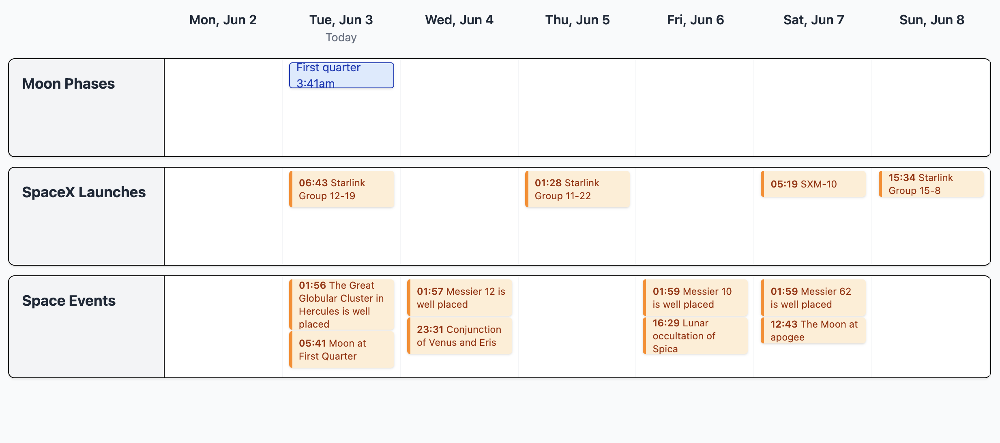

# Svelte Horizontal Calendar

A modern, responsive horizontal calendar view built with SvelteKit 5 that displays a rolling 7-day view with today as the second column. Perfect for visualizing events from multiple ICS calendar feeds in a clean, organized layout.

## Features

- **7-day rolling window** with today as the second column
- **Multiple ICS calendar support** with configurable feeds
- **Multi-day event spanning** with proper visual continuity
- **Recurring event expansion** with full RRULE support
- **Timezone-aware** date calculations
- **Responsive masonry layout** with optimal event placement
- **Clean visual design** with TailwindCSS styling
- **Real-time event filtering** and conflict detection

## Preview



## Getting Started

1. **Clone and install dependencies:**
```bash
git clone <repository-url>
cd svelte-horizontal-calendar
npm install
```

2. **Configure your calendars:**
```bash
cp config.sample.json config.json
# Edit config.json with your ICS calendar URLs
```

3. **Start the development server:**
```bash
npm run dev
```

## Configuration

Create a `config.json` file in the project root with your calendar configuration:

```json
{
  "calendars": [
    {
      "name": "Work Calendar",
      "icsUrl": "https://your-calendar-provider.com/calendar.ics"
    },
    {
      "name": "Personal Events", 
      "icsUrl": "https://another-calendar.com/events.ics"
    }
  ]
}
```

Each calendar appears as a separate row in the horizontal layout.

## Building for Production

```bash
npm run build
```

You can preview the production build with `npm run preview`.

## Technical Details

- **Framework:** SvelteKit 5 with TypeScript
- **Styling:** TailwindCSS
- **Calendar Parsing:** ts-ics library with RRULE support
- **Event Layout:** Custom masonry algorithm with collision detection
- **CORS Handling:** Server-side API proxy for ICS feeds

## Project Structure

```
├── src/
│   ├── routes/
│   │   ├── +page.svelte          # Main calendar component
│   │   └── api/calendars/        # ICS fetching API
│   └── lib/                      # Shared utilities
├── config.json                   # Calendar configuration (your file)
├── config.sample.json            # Example configuration
└── static/                       # Static assets
```

## License

MIT